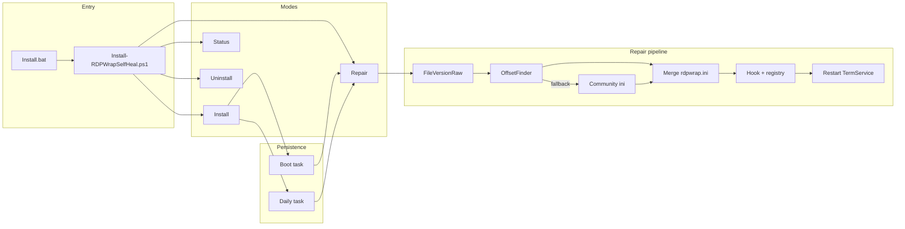
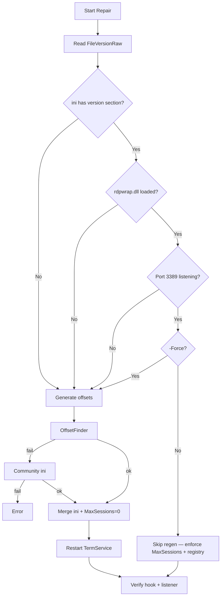
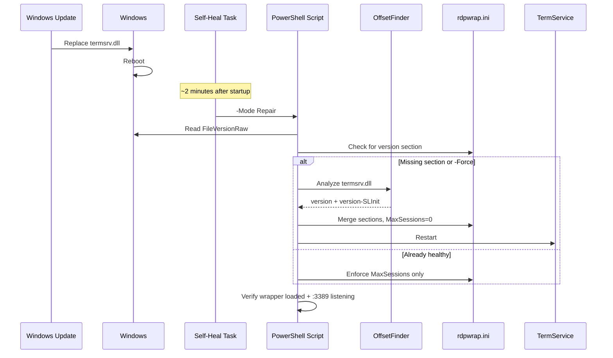

<div align="center">

# RDPWrap Self-Heal

### Self-healing RDP Wrapper for multi-session Remote Desktop on Windows 10, 11 & Server

Automatically repair **RDP Wrapper** after **Windows Update** — regenerate `termsrv.dll` / `rdpwrap.ini` offsets, fix Windows Server **MaxSessions**, and restore **concurrent Remote Desktop** sessions on boot.

<br/>

[](LICENSE)
[](https://www.microsoft.com/windows)
[](https://learn.microsoft.com/powershell/)
[](#system-requirements)
[](https://github.com/BuildWithSubha/RDPWrap-Self-Heal)
[](https://github.com/BuildWithSubha/RDPWrap-Self-Heal/stargazers)
[](https://github.com/BuildWithSubha/RDPWrap-Self-Heal/issues)
[](https://github.com/BuildWithSubha/RDPWrap-Self-Heal/commits/main)

<br/>

```text
git clone https://github.com/BuildWithSubha/RDPWrap-Self-Heal.git
# Right-click Install.bat → Run as administrator
```

[Why it breaks](#why-rdp-wrapper-breaks-after-windows-update) ·
[Features](#features) ·
[Quick Start](#quick-start-install-multi-session-rdp) ·
[Usage](#usage-and-commands) ·
[Troubleshooting](#troubleshooting-common-rdp-wrapper-errors) ·
[FAQ](#faq) ·
[Contributing](#contributing)

</div>

---

## Table of Contents

- [What is RDPWrap Self-Heal?](#what-is-rdpwrap-self-heal)
- [Why RDP Wrapper breaks after Windows Update](#why-rdp-wrapper-breaks-after-windows-update)
- [Who this is for](#who-this-is-for)
- [Features](#features)
- [Quick Start: Install multi-session RDP](#quick-start-install-multi-session-rdp)
- [System requirements](#system-requirements)
- [Installation guide](#installation-guide)
- [Usage and commands](#usage-and-commands)
- [Architecture](#architecture)
- [How self-heal works](#how-self-heal-works)
- [Repository layout](#repository-layout)
- [Technical notes](#technical-notes)
- [FAQ](#faq)
- [Troubleshooting common RDP Wrapper errors](#troubleshooting-common-rdp-wrapper-errors)
- [Roadmap](#roadmap)
- [Contributing](#contributing)
- [Security and legal](#security-and-legal)
- [License](#license)
- [Credits and related projects](#credits-and-related-projects)

---

## What is RDPWrap Self-Heal?

**RDPWrap Self-Heal** is an open-source installer and automation package for [RDP Wrapper](https://github.com/stascorp/rdpwrap) on **Windows 10**, **Windows 11**, and **Windows Server** (2019 / 2022 / 2025). It keeps **multiple concurrent Remote Desktop (RDP) sessions** working when Microsoft updates replace `termsrv.dll` and invalidate `rdpwrap.ini` offsets.

In plain terms: if RDP Wrapper stops after a Windows Update — RDPConf shows **`[not supported]`**, or worse **`[fully supported]`** while the third user still disconnects — this project installs the wrapper, regenerates offsets with [OffsetFinder](https://github.com/llccd/RDPWrapOffsetFinder), enforces Server **MaxSessions=0**, and registers **boot + daily** repair tasks so multi-session RDP can recover automatically.

| Capability | What you get |
|------------|--------------|
| Multi-session RDP | Concurrent Active sessions for multiple users |
| Post-update repair | Auto-heal after `termsrv.dll` changes |
| Windows Server fix | Removes the common Remote Admin 2-session cap |
| Homelab / lab friendly | No RDS CALs path (unsupported by Microsoft — see [legal](#security-and-legal)) |

Verified on **Windows Server 2025** with three concurrent Active RDP sessions after a `termsrv` update broke a long-running install.

---

## Why RDP Wrapper breaks after Windows Update

[RDP Wrapper](https://github.com/stascorp/rdpwrap) enables **concurrent Remote Desktop sessions** by patching policy checks inside Windows Terminal Services (`termsrv.dll`). Every **Windows Update** that replaces `termsrv.dll` can change memory offsets. Without updated `rdpwrap.ini` sections, multi-session RDP fails — often in confusing ways:

| Symptom people search for | What you see |
|---------------------------|--------------|
| “RDP Wrapper not supported” | RDPConf / RDP_CnC shows `[not supported]` |
| “RDPConf fully supported but third user disconnects” | Green status, then a 30-second disconnect prompt for the 3rd session |
| “Windows Server only allows 2 RDP sessions” | Cap remains even when offsets look correct (`MaxSessions=2`) |

> [!IMPORTANT]
> **Green RDPConf is not proof of working multi-session RDP.**  
> Run `query user` and confirm **3+ Active** sessions — that is the real test.

---

## Who this is for

- Homelab and small-team admins who need **multiple RDP sessions on Windows 10/11**
- Operators running **Windows Server** without (or instead of) full **RDS Session Host + RDS CALs**
- Anyone whose **RDP Wrapper broke after Windows Update** and needs a repeatable repair path
- Maintainers who want **OffsetFinder + community `rdpwrap.ini` + scheduled self-heal** in one package

If you need Microsoft-supported multi-user Remote Desktop, use the official **Remote Desktop Session Host** role and RDS licensing instead.

---

## Features

<table>
<tr>
<td width="50%" valign="top">

### Automation & self-heal
- One-click elevated install (`Install.bat`)
- Modes: Install · Repair · Status · Uninstall
- Smart repair — skips work when already healthy
- Boot + daily SYSTEM scheduled tasks after Windows Update

</td>
<td width="50%" valign="top">

### Correct offsets & Server policy
- Matches `termsrv.dll` by **FileVersionRaw** (not the lagging FileVersion string)
- Forces SLPolicy **MaxSessions=0** for Windows Server multi-session RDP
- Dual sources: OffsetFinder → [community rdpwrap.ini](https://github.com/sebaxakerhtc/rdpwrap.ini)
- Timestamped `rdpwrap.ini` backups before every merge

</td>
</tr>
<tr>
<td width="50%" valign="top">

### Operations & diagnostics
- Enables RDP and disables single-session-per-user in the registry
- Structured logs under `Program Files\RDP Wrapper\logs\`
- Status mode for version, hook, listener, and `query user`
- Task uninstall without removing the RDP Wrapper hook

</td>
<td width="50%" valign="top">

### Resilience
- Offline repair when PDB / symbols are available
- Online fallback when OffsetFinder cannot produce offsets
- Survives Windows Update + reboot cycles
- Clear errors when a new `termsrv` build has no offsets yet

</td>
</tr>
</table>

### Scheduled self-heal tasks

| Task | When | Runs as | Purpose |
|------|------|---------|---------|
| `RDPWrap-SelfHeal-Boot` | ~2 minutes after startup | `SYSTEM` (Highest) | Repair after update reboot |
| `RDPWrap-SelfHeal-Daily` | Every day at 03:00 | `SYSTEM` (Highest) | Catch missed repairs |

Both run `-Mode Repair` from `C:\Program Files\RDP Wrapper\`.

---

## Quick Start: Install multi-session RDP

### 1. Download the package

```powershell
git clone https://github.com/BuildWithSubha/RDPWrap-Self-Heal.git
cd RDPWrap-Self-Heal
```

Or download the repository ZIP from [GitHub](https://github.com/BuildWithSubha/RDPWrap-Self-Heal) and extract it.

### 2. Install RDP Wrapper Self-Heal

**Recommended — one click**

Right-click **`Install.bat`** → **Run as administrator**

**Or elevated PowerShell**

```powershell
Set-ExecutionPolicy -Scope Process Bypass
.\scripts\Install-RDPWrapSelfHeal.ps1 -Mode Install
```

### 3. Check RDP_CnC / RDPConf

Open `C:\Program Files\RDP Wrapper\RDP_CnC.exe` and confirm:

- [x] Wrapper Installed  
- [x] Service Running  
- [x] Listener Listening  
- [x] **Single session per user** unchecked  
- [ ] `[fully supported]` (ideal — not required for proof)

### 4. Prove concurrent RDP sessions work

Keep one session open, connect two more users, then run:

```powershell
query user
```

**Success example (3 Active RDP sessions):**

```text
 USERNAME              SESSIONNAME        ID  STATE   IDLE TIME  LOGON TIME
 Administrator         rdp-tcp#0           1  Active          .  7/23/2026 9:00 AM
 test                  rdp-tcp#1           2  Active          .  7/23/2026 9:05 AM
 ankit                 rdp-tcp#2           3  Active          .  7/23/2026 9:06 AM
```

Three or more **Active** lines means multi-session Remote Desktop is working.

---

## System requirements

| Requirement | Details |
|-------------|---------|
| Operating system | Windows 10, Windows 11, or Windows Server 2019 / 2022 / 2025 |
| Architecture | **x64** only |
| Privileges | Administrator for install and repair |
| PowerShell | 5.1 or later |
| Network | Optional — required only for community `rdpwrap.ini` fallback |
| Symbols / PDB | Optional — enables offline OffsetFinder against `termsrv.dll` |

> [!WARNING]
> Do **not** install alongside **RDS-RD-Server** (Remote Desktop Session Host).  
> Choose **either** RDP Wrapper **or** official RDS — not both.

---

## Installation guide

### What `-Mode Install` does

1. Validates Administrator rights and package files  
2. Deploys `bin\` + OffsetFinder → `C:\Program Files\RDP Wrapper\`  
3. Copies the self-heal script for scheduled tasks  
4. Enforces `MaxSessions=0` in `rdpwrap.ini` (critical on Windows Server)  
5. Registers boot + daily repair tasks  
6. Runs an initial repair: hook TermService, apply offsets, update registry, restart the service  

### Installed files

```text
C:\Program Files\RDP Wrapper\
├── rdpwrap.dll                 # RDP Wrapper library
├── rdpwrap.ini                 # Offset database + SLPolicy
├── RDPWInst.exe                # Wrapper installer / uninstaller
├── RDP_CnC.exe                 # RDP control panel (RDPConf-style)
├── RDPWrapOffsetFinder.exe     # Offset generator
├── Install-RDPWrapSelfHeal.ps1 # Self-heal orchestrator
└── logs\
    └── selfheal_YYYYMMDD.log
```

### Antivirus note (`rdpwrap.dll` quarantined)

> [!CAUTION]
> Security tools often quarantine `rdpwrap.dll` as potentially unwanted software.  
> Add an exclusion for `C:\Program Files\RDP Wrapper\` and this repository folder.  
> If the DLL is removed, restore [`bin/rdpwrap.dll`](bin/rdpwrap.dll) and re-run Install.

### Uninstall

```powershell
# Remove self-heal tasks only (keep RDP Wrapper)
.\scripts\Install-RDPWrapSelfHeal.ps1 -Mode Uninstall

# Fully remove the RDP Wrapper hook from TermService
& "$env:ProgramFiles\RDP Wrapper\RDPWInst.exe" -u
```

---

## Usage and commands

### Modes

| Mode | Command | When to use |
|------|---------|-------------|
| Install | `-Mode Install` | First-time setup of multi-session RDP Wrapper |
| Repair | `-Mode Repair` | After Windows Update if auto-heal did not finish |
| Force repair | `-Mode Repair -Force` | Always regenerate `termsrv` offsets |
| Status | `-Mode Status` | Diagnose wrapper, MaxSessions, listener, sessions |
| Uninstall | `-Mode Uninstall` | Remove self-heal tasks only |

### Examples

```powershell
# Fresh install of RDP Wrapper Self-Heal
.\scripts\Install-RDPWrapSelfHeal.ps1 -Mode Install

# Repair RDP Wrapper after Windows Update
.\scripts\Install-RDPWrapSelfHeal.ps1 -Mode Repair -Force

# Check multi-session RDP health
.\scripts\Install-RDPWrapSelfHeal.ps1 -Mode Status

# Same entry point the scheduled tasks use
& "$env:ProgramFiles\RDP Wrapper\Install-RDPWrapSelfHeal.ps1" -Mode Repair
```

### Logs

```powershell
Get-Content "$env:ProgramFiles\RDP Wrapper\logs\selfheal_$(Get-Date -Format yyyyMMdd).log" -Tail 50
```

---

## Architecture



| Layer | Component | Role |
|-------|-----------|------|
| Entry | [`Install.bat`](Install.bat) | Elevation check → PowerShell |
| Orchestration | [`scripts/Install-RDPWrapSelfHeal.ps1`](scripts/Install-RDPWrapSelfHeal.ps1) | Modes, logging, error handling |
| Runtime | [`bin/`](bin/) | `rdpwrap.dll`, installer, ini, RDP_CnC |
| Offsets | [`tools/OffsetFinder/`](tools/OffsetFinder/) | PDB / pattern offset generation for `termsrv.dll` |
| Persistence | Scheduled Tasks | Automatic repair after Windows Update |

### Repair decision tree



---

## How self-heal works



**How offsets are resolved**

1. **OffsetFinder** — analyze local `termsrv.dll` (PDB/symbols when available)  
2. **Community ini** — fetch matching sections from [sebaxakerhtc/rdpwrap.ini](https://github.com/sebaxakerhtc/rdpwrap.ini)  
3. **Fail clearly** — report the `termsrv` version that still needs offsets  

Jump to: [Quick Start](#quick-start-install-multi-session-rdp) · [Troubleshooting](#troubleshooting-common-rdp-wrapper-errors) · [FAQ](#faq)

---

## Repository layout

```text
RDPWrap-SelfHeal/
├── Install.bat                       # One-click elevated installer
├── README.md                         # Documentation (this file)
├── LICENSE                           # Apache-2.0
├── NOTICE                            # Third-party notices
├── CREDITS.md
├── .gitignore
│
├── bin/                              # RDP Wrapper runtime
│   ├── rdpwrap.dll
│   ├── rdpwrap.ini                   # Community offsets + MaxSessions=0
│   ├── RDPWInst.exe
│   ├── RDP_CnC.exe
│   └── update.bat
│
├── scripts/
│   └── Install-RDPWrapSelfHeal.ps1   # Install / Repair / Status / Uninstall
│
├── tools/OffsetFinder/
│   ├── 64bit/                        # Deployed finder (+ optional PDBs)
│   └── 32bit/                        # Bundled; not used by the x64 installer
│
└── docs/
    ├── TROUBLESHOOTING.md            # Extended RDP Wrapper troubleshooting
    └── PUBLISH.md                    # Maintainer publish + discoverability checklist
```

---

## Technical notes

### FileVersionRaw vs FileVersion (common RDP Wrapper footgun)

Windows Explorer may show `10.0.26100.32684` while the PE private build is `10.0.26100.33158`. RDP Wrapper matches the **raw** four-part version in `rdpwrap.ini`. This project always uses raw:

```powershell
$vi = (Get-Item $env:SystemRoot\System32\termsrv.dll).VersionInfo
'{0}.{1}.{2}.{3}' -f $vi.FileMajorPart, $vi.FileMinorPart, $vi.FileBuildPart, $vi.FilePrivatePart
```

### Why MaxSessions=0 matters for Windows Server RDP

Stock community `rdpwrap.ini` often ships:

```ini
TerminalServices-RemoteConnectionManager-45344fe7-00e6-4ac6-9f01-d01fd4ffadfb-MaxSessions=2
```

That re-applies Remote Administration’s **two-session** policy. This package sets it to **`0`** (unlimited). Without that change, Server hosts often stay capped at 2 RDP sessions even when DefPolicy offsets are correct and RDPConf is green.

### RDP Wrapper vs Remote Desktop Session Host (RDS)

| Approach | Pros | Cons |
|----------|------|------|
| **RDP Wrapper** (this repository) | Familiar for labs; no RDS CAL workflow | Unsupported by Microsoft; can break on new `termsrv` builds |
| **RDS-RD-Server** | Official multi-user Remote Desktop | Grace period, then **RDS CALs** + license server |

---

## FAQ

<details>
<summary><strong>How do I enable multiple RDP sessions on Windows 10 or Windows 11?</strong></summary>

Install this package with `Install.bat` (Run as administrator), then verify with `query user` while three users are connected. Consumer Windows editions are not licensed for unlimited concurrent RDP the way Server/RDS is — comply with Microsoft licensing for your scenario.
</details>

<details>
<summary><strong>Why does RDP Wrapper stop working after Windows Update?</strong></summary>

Windows Update often replaces `termsrv.dll`. Offset entries in `rdpwrap.ini` no longer match, so the wrapper cannot patch Terminal Services correctly. This project’s boot task regenerates offsets after reboot.
</details>

<details>
<summary><strong>RDPConf says fully supported but the 3rd user still disconnects — why?</strong></summary>

RDPConf mainly checks whether offsets exist and the wrapper is loaded. Session policy (especially Server `MaxSessions=2`) can still block concurrent users. Run `-Mode Repair -Force`, confirm `MaxSessions=0`, and verify with `query user`.
</details>

<details>
<summary><strong>How do I fix RDP Wrapper showing [not supported]?</strong></summary>

```powershell
.\scripts\Install-RDPWrapSelfHeal.ps1 -Mode Repair -Force
```

If OffsetFinder and the community ini both lack your `termsrv` build, wait for updated offsets or generate them with symbols, then repair again. See [Troubleshooting](#troubleshooting-common-rdp-wrapper-errors).
</details>

<details>
<summary><strong>Is RDP Wrapper supported by Microsoft?</strong></summary>

No. It modifies Terminal Services behavior and is unsupported. Use at your own risk and ensure licensing compliance. Official multi-user RDP uses Remote Desktop Session Host + RDS CALs.
</details>

<details>
<summary><strong>Do I need internet for OffsetFinder?</strong></summary>

Not if local PDB/symbols can produce offsets. Internet is required for the community `rdpwrap.ini` fallback when the finder fails.
</details>

<details>
<summary><strong>Can I use this with RD Session Host / RDS-RD-Server installed?</strong></summary>

No. Do not mix RDP Wrapper with `RDS-RD-Server`. Uninstall one before using the other. “No Remote Desktop Licence Servers available” is an RDS message, not an RDP Wrapper message.
</details>

<details>
<summary><strong>Does this work on Windows Server 2022 and 2025?</strong></summary>

Yes — that is a primary target. Server builds often need the **MaxSessions=0** fix in addition to correct offsets. Always prove with `query user`, not RDPConf alone.
</details>

---

## Troubleshooting common RDP Wrapper errors

| Problem / search phrase | Fix |
|-------------------------|-----|
| Third RDP user kicked after 30 seconds | `.\scripts\Install-RDPWrapSelfHeal.ps1 -Mode Repair -Force` |
| RDP Wrapper / RDPConf `[not supported]` | Force repair; check logs if OffsetFinder failed |
| RDP broken after Windows Update | Wait for reboot + ~2 min boot task, then force repair |
| Antivirus deleted `rdpwrap.dll` | Restore from `bin\`, add exclusion, re-run Install |
| Only 2 RDP sessions on Windows Server | Confirm `MaxSessions=0` in `rdpwrap.ini`, then repair |
| “No Remote Desktop Licence Servers available” | RDS Session Host is installed — remove RDS or configure licensing |

### Diagnostic commands

```powershell
.\scripts\Install-RDPWrapSelfHeal.ps1 -Mode Status

Select-String -Path "$env:ProgramFiles\RDP Wrapper\rdpwrap.ini" -Pattern '45344fe7.*MaxSessions'
tasklist /m rdpwrap.dll
query user
```

### Before opening a GitHub issue

Include:

1. Output of `-Mode Status`  
2. `query user` while reproducing  
3. `termsrv.dll` **FileVersionRaw** (not Explorer’s string)  
4. Client vs Server SKU  
5. Whether RDS Session Host is installed:

```powershell
Get-WindowsFeature RDS-RD-Server
```

Extended guide: **[docs/TROUBLESHOOTING.md](docs/TROUBLESHOOTING.md)**

---

## Roadmap

| Version | Focus | Status |
|---------|-------|--------|
| **v1.0** | Install / Repair / Status / Uninstall, FileVersionRaw matching, OffsetFinder + community fallback, MaxSessions=0, boot/daily tasks, docs | ✅ Shipped |
| **v1.1** | CI syntax checks, release ZIPs, `-WhatIf` dry-run, Windows Event Log entries | 🔲 Planned |
| **v1.2** | `-Mode Diagnose` JSON export, post-repair notifications, offset contribution helper | 🔲 Planned |
| **Later** | Winget package, VM-based integration tests | 💭 Ideas |

Track progress in [GitHub Issues](https://github.com/BuildWithSubha/RDPWrap-Self-Heal/issues).

---

## Contributing

Contributions help more people find and fix broken **multi-session RDP** installs — especially new `termsrv.dll` offsets, clearer diagnostics, and documentation improvements.

### Workflow

1. Fork [BuildWithSubha/RDPWrap-Self-Heal](https://github.com/BuildWithSubha/RDPWrap-Self-Heal)  
2. Create a branch: `feature/…` or `fix/…`  
3. Keep the change focused (one concern per PR)  
4. Test on a Windows VM: Install → connect 3 users → `query user`  
5. Open a pull request with what changed and how you verified it  

### Local development

```powershell
git clone https://github.com/BuildWithSubha/RDPWrap-Self-Heal.git
cd RDPWrap-Self-Heal

# Syntax check
powershell -NoProfile -Command "& { $null = [System.Management.Automation.Language.Parser]::ParseFile('scripts\Install-RDPWrapSelfHeal.ps1', [ref]$null, [ref]$errs); if ($errs) { $errs; exit 1 } else { 'OK' } }"

# Read-only health check (if already installed)
.\scripts\Install-RDPWrapSelfHeal.ps1 -Mode Status
```

### Offset contributions

If you confirm a new Windows build:

1. Prefer OffsetFinder-generated `[version]` + `[version-SLInit]` blocks  
2. Contribute upstream to [sebaxakerhtc/rdpwrap.ini](https://github.com/sebaxakerhtc/rdpwrap.ini)  
3. Optionally open a PR here to refresh the bundled ini  

### Guidelines

- Do not commit secrets, credentials, or machine-specific dumps  
- Do not submit pirated RDS CALs or licensing circumvention tools  
- Match existing PowerShell style; keep diffs small  
- Prefer evidence (`query user`, FileVersionRaw, Status output) over screenshots alone  

---

## Security and legal

> [!WARNING]
> **Use at your own risk.** RDP Wrapper modifies Terminal Services. Antivirus may flag `rdpwrap.dll`.

- Enabling concurrent Remote Desktop sessions on editions that do not include that right may **violate Microsoft licensing**. Compliance is your responsibility.  
- Upstream binaries are redistributed for convenience; copyright remains with original authors — see [NOTICE](NOTICE) and [CREDITS.md](CREDITS.md).  
- Cached Microsoft symbols under `tools/OffsetFinder/*/sym/` follow [Microsoft symbol license terms](https://learn.microsoft.com/windows-hardware/drivers/debugger/). Remove `sym/` before publishing if unsure.

---

## License

Licensed under the **[Apache License 2.0](LICENSE)**.

Third-party components keep their own licenses — see [NOTICE](NOTICE).

---

## Credits and related projects

This repository is a packaging and self-heal automation layer built on community work:

| Project | Role |
|---------|------|
| [stascorp/rdpwrap](https://github.com/stascorp/rdpwrap) | Original RDP Wrapper Library |
| [sebaxakerhtc/rdpwrap](https://github.com/sebaxakerhtc/rdpwrap) | Modern installer / RDP_CnC |
| [sebaxakerhtc/rdpwrap.ini](https://github.com/sebaxakerhtc/rdpwrap.ini) | Community `rdpwrap.ini` offset database |
| [llccd/RDPWrapOffsetFinder](https://github.com/llccd/RDPWrapOffsetFinder) | Offset generation for new `termsrv.dll` builds |

Full attributions: **[CREDITS.md](CREDITS.md)** · Maintainer checklist: **[docs/PUBLISH.md](docs/PUBLISH.md)**

---

<div align="center">

**Looking for a self-healing RDP Wrapper that survives Windows Update?**  
If this restored your concurrent Remote Desktop sessions, consider starring the repo.

<br/>

[](https://github.com/BuildWithSubha/RDPWrap-Self-Heal)

<br/>

[Report an Issue](https://github.com/BuildWithSubha/RDPWrap-Self-Heal/issues) ·
[Request a Feature](https://github.com/BuildWithSubha/RDPWrap-Self-Heal/issues/new) ·
[Troubleshooting](#troubleshooting-common-rdp-wrapper-errors) ·
[Contributing](#contributing) ·
[License](LICENSE)

</div>
